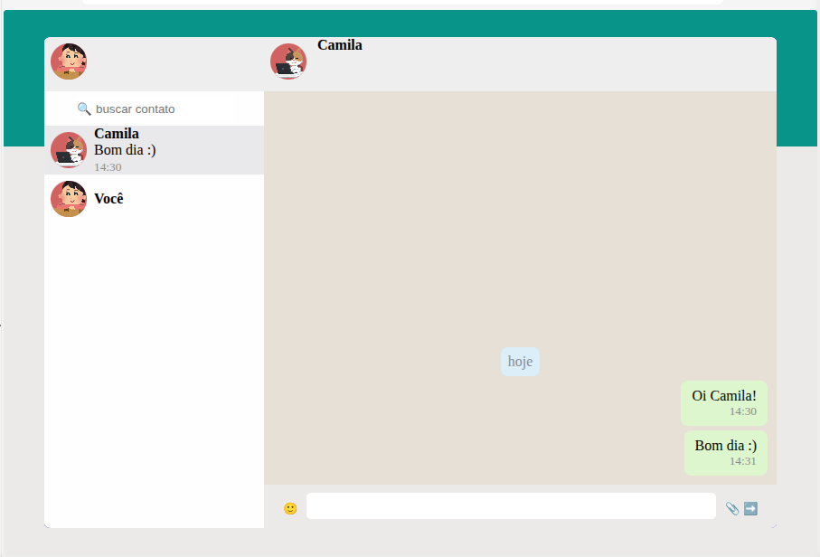

# Desafio (aplicativo de mensagens)

## Tarefa

Elaborar o layout de uma aplicação de comunicação por mensagens de texto – protótipo funcional

## Considerações

- está funcional apenas no campo de mensagens
- fiz direto pelo VSCode utilizando o live server 
- como o codepen aceita uma quantidade limitada de arquivos, utilizarei emojis para simular imagens
- quero melhorar depois com mais calma

## Resultado Final

[Versão do CodePen](https://codepen.io/editor/Gabriella-P/pen/019fecbd-47c4-7b65-a0ee-eb9908d17b36)
